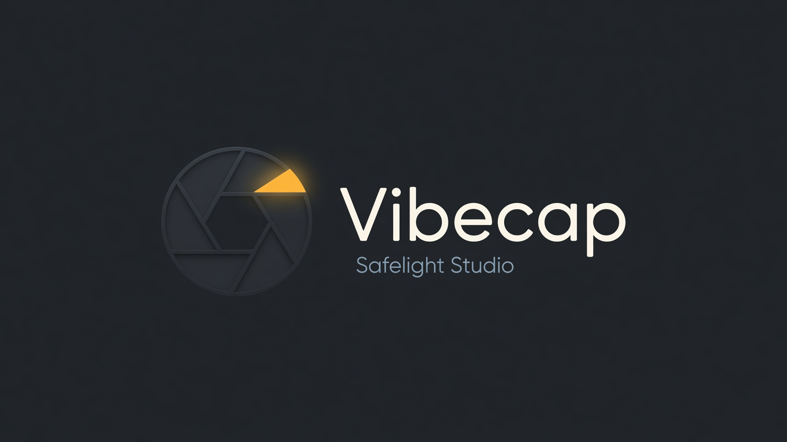

<p align="center">
  
</p>

# Vibecap Studio

[](LICENSE-MIT)
[](https://www.rust-lang.org/)
[](docs/PLATFORMS.md)
[](https://github.com/TekosherM/vibecap/actions/workflows/ci.yml)

**Native screen capture + a web evidence studio for humans and AI coding agents.**  
Rust desktop app with a menu-bar tray and stdio MCP. Web studio with an HTTP connector so agents can capture, snap while recording, and pack frontend + backend + database + logs.

Brand assets: [docs/brand/](docs/brand/).

---

## Two connectors

| | Native CLI / MCP | Web |
| :--- | :--- | :--- |
| How the agent attaches | **CLI** (`record start` / `--screenshot` / `record stop`) — no mcp.json required. Or `vibecap --mcp` via [`.cursor/mcp.json`](.cursor/mcp.json). | Open tab for Lumen Cart. **Or** HTTP with `display` / `output_dir` (same native capturer). |
| Capture | Target display / window (Linux: **ffmpeg x11grab**) | Native screen if those args are set; otherwise the shutter (demo / getDisplayMedia) |
| Evidence | Screen pixels | Pixels **plus** DOM, console, HTTP, shell, database, logs (Lumen Cart) |
| Output | `--output-dir` (default: `vibecap --paths`) | Pack + Media, **or** the caller `output_dir` for native stills |

**Capture-only (signed-in Chrome / desktop flow):** see [docs/AGENTS.md](docs/AGENTS.md). Start / still / stop, files in `--output-dir`.

Lumen Cart evidence job: `vibecap_job`. Inbox is optional.

- Web: [docs/WEB.md](docs/WEB.md) · [docs/HOOKS.md](docs/HOOKS.md) · [docs/STATE.md](docs/STATE.md) · [web/README.md](web/README.md)
- Native MCP: [docs/MCP.md](docs/MCP.md)
- Skill (short, capture-only first): [skills/vibecap/SKILL.md](skills/vibecap/SKILL.md)

---
## Try it with your agent

Vibecap is built for **smooth visual feedback loops** with whatever harness you already use — Cursor, Claude Code, Codex, Windsurf, Gemini, OpenCode, custom MCP clients, or your own agent stack.

1. **Keep the desktop app running** (menu bar / tray) while you code.  
2. Point your agent at the MCP server (`vibecap --mcp`) and/or the [agent skill](skills/vibecap/SKILL.md).  
3. Let the agent **capture screenshots, record motion GIFs, and open Inbox questions** when it needs your eyes.  
4. You get a **notification**, tray **Inbox** badge, and Dock bounce — answer with text, chips, voice, or mark-up.

That loop is the product: agent sees the screen, you stay in flow, feedback stays visual and fast.

### Agent path (CLI — works when MCP never attaches)

Cursor / Grok Bot dynamic-tool harnesses often never list `vibecap_*` MCP tools. Use the binary:

```bash
OUT=./frames
vibecap record start --output-dir "$OUT" --display "$DISPLAY"
vibecap --screenshot --output-dir "$OUT"
vibecap record stop
```

Linux backend is **ffmpeg x11grab** (supported, not a fallback). `ffmpeg` + `$DISPLAY` required.

### Web studio (HTTP)

Lumen Cart pack, **or** native stills when you pass `display` / `output_dir`:

```bash
cd web && npm install && npm run dev
```

```
POST /api/agent/call {"tool":"vibecap_capture","args":{"display":":0","output_dir":"./frames"}}
POST /api/agent/call {"tool":"vibecap_job"}
```

Without `display` / `window` / `output_dir`, `GET /api/agent/still/{id}.jpg` is the **shutter** (demo pay screen if source is Demo).

### Native (MCP)

```bash
./scripts/vibecap-mcp.sh    # portable; used by .cursor/mcp.json
# or: vibecap --mcp
```

---

## Fork · clone · contribute

We want people using Vibecap on real agent workflows and telling us what breaks.

| | |
| :--- | :--- |
| **Clone** | `git clone https://github.com/TekosherM/vibecap.git` |
| **Fork** | [github.com/TekosherM/vibecap](https://github.com/TekosherM/vibecap/fork) |
| **Try** | `cargo install --path .` then `vibecap` + wire MCP |
| **Feedback** | [Issues](https://github.com/TekosherM/vibecap/issues) — capture bugs, agent harness notes, UX friction |
| **Contribute** | PRs welcome — see [CONTRIBUTING.md](CONTRIBUTING.md) |

Please **run it with your agent / harness** and open issues with: OS, how you launched MCP, what you expected to see, and a short capture path if you can share one. Visual repros (screenshot or short GIF via Vibecap itself) are ideal.

---

## Features

- **Screen capture** — full / region / window; screenshots restore the previous frontmost app (macOS)
- **Recording** — 30/60 FPS via ffmpeg; optional audio; countdown; tray live `REC mm:ss`
- **Clip + Still studios** — dedicated Loop stages for video trim/GIF and image adjust/save
- **Annotation** — pen, arrow, rect, highlight, text, blur, step badges, clipboard
- **Agent Inbox** — HITL questions with OS notification, tray title, Dock bounce, dual-pane reply
- **MCP (16 tools)** — capture, record, GIF export, live inspection, budget, retro buffer, feedback, apps list, bug pack
- **Web HTTP studio** — unbounded record, snap-while-REC, hook plan (DOM / console / HTTP / DB / logs), downloadable JPEG + WebM + JSON pack
- **Safelight UI** — Graphite / light theme, Loop rail, Shutter dock, ⌘K palette, first-run wizard
- **Lightweight** — single binary (~15 MB), no Electron, no always-on cloud

---

## Vibecap vs browser MCPs

| Workspace | Browser MCPs | Vibecap |
| :--- | :--- | :--- |
| **Web DOM** | ✅ | ✅ (via capture) |
| **Native desktop apps** | ❌ | ✅ |
| **Mobile simulators** | ❌ | ✅ |
| **Game / WebGL canvases** | ⚠️ often fails | ✅ |
| **Human voice & drawing** | ❌ | ✅ |
| **Motion / animation** | ⚠️ stills only | ✅ GIF / video |

---

## Install & run

### Prerequisites

- [Rust](https://rustup.rs/) (edition 2021)
- [ffmpeg](https://ffmpeg.org/) — GUI also finds Homebrew at `/usr/local/bin` and `/opt/homebrew/bin` (or set `VIBECAP_FFMPEG`)
- **macOS:** Screen Recording permission for Vibecap (and Terminal if you use CLI only)

### Prebuilt binaries

[Releases](https://github.com/TekosherM/vibecap/releases) — macOS arm64/x64, Linux, Windows.

### macOS app (Applications / Spotlight)

```bash
./scripts/install_macos_app.sh
# → /Applications/Vibecap.app
open -a Vibecap
```

### From source

```bash
git clone https://github.com/TekosherM/vibecap.git
cd vibecap
cargo install --path .
vibecap --help
```

| Command | What it does |
| :--- | :--- |
| `vibecap` | Desktop UI + tray |
| `vibecap --hidden` | Start in tray only |
| `vibecap --no-tray` | Window close quits |
| `vibecap --mcp` | Stdio MCP for agents |
| `vibecap --screenshot` | Headless still of the named display/window; prints path |
| `vibecap record start` / `stop` | Unbounded MP4 (agent long flows) |
| `vibecap --paths` | Print the one default media dir + backend |

**Tray:** status · Show/Hide · Screenshot/Record · Loop stages (Shutter · Media · Clip · Still · Inbox · Settings) · Bug pack · Quit.

Closing the window **hides to the tray**. Use **Quit Vibecap** to exit.

| Shortcut | Action |
| :--- | :--- |
| **S** / **R** (app focused) | Screenshot / record |
| **Ctrl+Shift+3** / **2** (global) | Screenshot / record |
| **⌘K** / **Ctrl+K** | Command palette |

### Verify

```bash
./scripts/smoke_mcp.sh
SMOKE_CAPTURE=1 ./scripts/smoke_mcp.sh   # optional real capture
```

---

## Documentation

| Doc | Contents |
| :--- | :--- |
| [docs/USAGE.md](docs/USAGE.md) | CLI, desktop stages, agent workflows |
| [docs/MCP.md](docs/MCP.md) | Native stdio MCP tools |
| [docs/WEB.md](docs/WEB.md) | Web HTTP studio + agent loop |
| [docs/HOOKS.md](docs/HOOKS.md) | When to collect DOM / console / HTTP / DB / video |
| [docs/ARCHITECTURE.md](docs/ARCHITECTURE.md) | Single-binary design |
| [web/README.md](web/README.md) | Run the web studio |
| [docs/PLATFORMS.md](docs/PLATFORMS.md) | macOS / Windows / Linux backends |
| [docs/TESTING.md](docs/TESTING.md) | Smoke + manual checks |
| [docs/FEEDBACK_USE_CASES.md](docs/FEEDBACK_USE_CASES.md) | HITL scenarios |
| [docs/brand/](docs/brand/) | Logo, app icon, marks |
| [CONTRIBUTING.md](CONTRIBUTING.md) | PR hygiene |
| [docs/AGENTS.md](docs/AGENTS.md) | CLI / harness (Cursor, Grok Bot) |
| [skills/vibecap/SKILL.md](skills/vibecap/SKILL.md) | Agent skill |

---

## Agent skill

| Location | Purpose |
| :--- | :--- |
| `skills/vibecap/SKILL.md` | Canonical skill |
| `.agents/skills/vibecap/SKILL.md` | Workspace copy (keep in sync) |

Copy or symlink into your agent skills dir (e.g. `~/.agents/skills/vibecap/`).

---

## Platform support

| Platform | Capture backend | Status |
| :--- | :--- | :--- |
| **macOS** | `screencapture` + ffmpeg | ✅ Primary |
| **Windows** | ffmpeg `gdigrab` | ✅ Builds; install ffmpeg |
| **Linux** | ffmpeg **x11grab** (agent backend); grim still fallback | ✅ Builds |

---

## Default paths

| Path | Use |
| :--- | :--- |
| `--output-dir` or `vibecap --paths` | Native stills / MP4. One documented default per OS. |
| `{config}/vibecap/` | Native budget, session, retro, feedback inbox |
| `{config}/vibecap/feedback/` | Native agent questions + your answers |
| Web Pack + Media | JPEG / WebM / JSON downloads. **Not** a home folder. |

---

## Development

```bash
# native
cargo build --release
./scripts/smoke_mcp.sh
cargo run --release -- --mcp

# web
cd web && npm install && npm run typecheck && npm run dev
```

Layout: `src/` native · `web/` HTTP studio · `docs/WEB.md` · `docs/HOOKS.md`.

---

## License

Licensed under either of:

- [Apache License, Version 2.0](LICENSE-APACHE)
- [MIT license](LICENSE-MIT)

at your option.

---

## Community

**Try it. Fork it. Break it with your agent. Tell us what you need.**

- Issues & ideas: [github.com/TekosherM/vibecap/issues](https://github.com/TekosherM/vibecap/issues)
- PRs: [CONTRIBUTING.md](CONTRIBUTING.md)
- Especially valuable: notes from **your** agent harness (Cursor, Claude Code, Codex, Windsurf, custom) on capture reliability and Inbox UX
